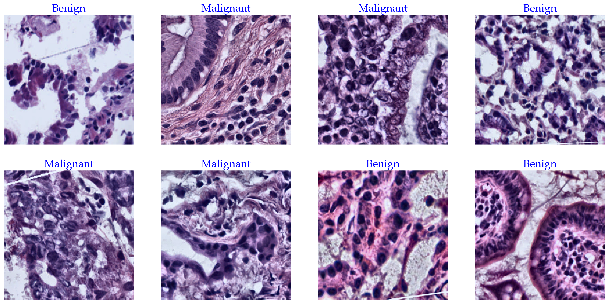

# CNN-TransLite

Lightweight CNN–Transformer for benign vs malignant classification of pancreatic H&E histopathology images.

---

## Histopathology Image Samples

Below are representative histopathological image patches used in this study, illustrating benign and malignant pancreatic tissue and the morphological heterogeneity present across classes.

---

## Image Acquisition (NCI GDC Data Portal)

Histopathological whole-slide images (WSIs) were obtained from the National Cancer Institute (NCI) Genomic Data Commons (GDC) Data Portal:

https://portal.gdc.cancer.gov/

Only cases with a primary diagnosis of pancreatic cancer and available diagnostic WSIs were considered. All slides were hematoxylin–eosin (H&E) stained and provided in SVS format at ultra-high resolution.

Due to the large size of WSIs (approximately 1–2 GB per slide), representative image patches were manually extracted using Aperio ImageScope, a digital pathology viewer commonly used in clinical practice. Patches were captured at magnifications ranging from 20× to 40×, focusing on diagnostically relevant regions described in the original pathology reports.

The resulting dataset consists of balanced benign and malignant pancreatic tissue patches.

Dataset access (Google Drive):
https://drive.google.com/drive/folders/1bsxa9dIgjIaBVwA85BgQDPZX72j18XkC?usp=sharing

---

## Data Augmentation

To mitigate overfitting and improve generalization, data augmentation was applied using the Albumentations library. The augmentation pipeline was designed to preserve histopathological structures while introducing controlled spatial and intensity variability.

After augmentation, the dataset was expanded to 1,000 images per class, ensuring class balance between benign and malignant samples.

### Augmentation configuration

| Augmentation        | Configuration |
|---------------------|---------------|
| Horizontal Flip     | Applied with probability p = 0.5 |
| Vertical Flip       | Applied with probability p = 0.5 |
| Rotation            | Random rotation up to ±25°, reflective padding (p = 1.0) |
| CLAHE               | Clip limit = 3, tile size = 8 × 8 (p = 0.8) |
| RGB Normalization   | Mean = [0.485, 0.456, 0.406], Std = [0.229, 0.224, 0.225] |

---

## Usage Notes

- The dataset is derived from WSIs available at the NCI GDC Data Portal.
- Images are shared for academic and research purposes only.
- Redistribution remains subject to the original GDC data usage terms.
